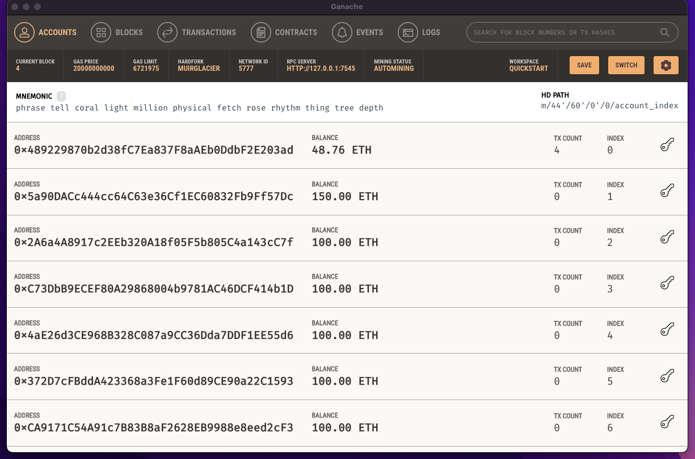
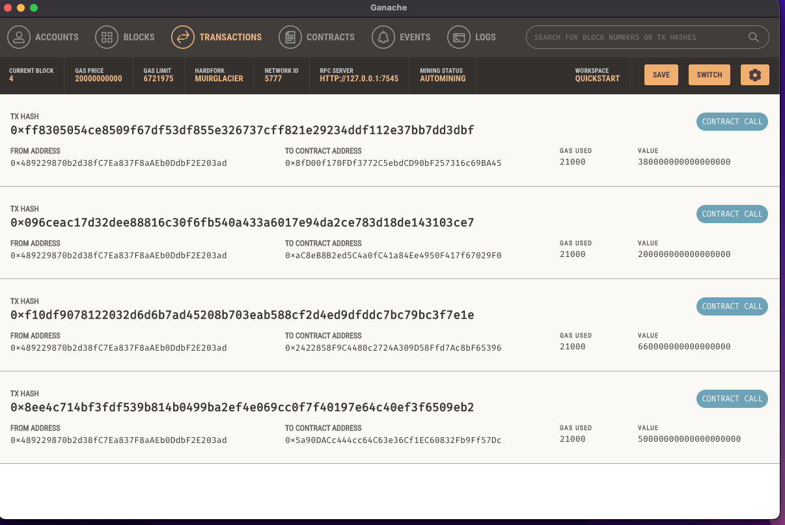

# Crypto Payment Application

## Table of Contents

 1. Project Motivation
 2. About the Application
 3. Techologies Used
 4. File Descriptions
 5. How to Run
 6. License
 

----------------------------

##  Project Motivation

This project is in completion of the Columbia University FinTech 2022 bootcamp module nineteen weekly challenge exercise.


## About the Application

This is a Fintech Professional finder app. Use to find Fintech professional open for work, and make payment system to hired fintech professional, with crypto currency.


## Technologies Used

The application is written in python programming langauge. Users need a device that can run python3 applications. Other python applications, libraries and frameworks used in this project include:

- Python (version 3.9 or higher)
- web3
- Ganache
- streamlit


## File Descriptions

1. Starter_Code
- crypto_wallet.py
- fintech_finder.py
- Resources
  - transaction_count.png
  - transactions.png

2. requirements.txt

3. README.md
4. Images

-----------------

## How to Run

1. Clone this repo 

2. In your terminal

```
  conda create -n <evn_name> python=3.7 
  conda activate <evn_name>
  git clone <link to repo>
  pip install -r requirements.txt 
  streamlit run fintech_finder.py

```
 
 
3. On your browser enter
 - Select a fintech professional you like to hire from the < select a person> dropdown
 - Add number of hours
 
4. Click on 'Send Transaction' botton

5. Open the Ganache app and see the Accounts updated







## License
This project is in completion of the Columbia University FinTech 2022 bootcamp module nineteen weekly challenge exercise. It should not be copied and used for commercial purpose without the authorization of the admin of this repo. For futher information please contact Patrick via email on pruejoma@gmail.com